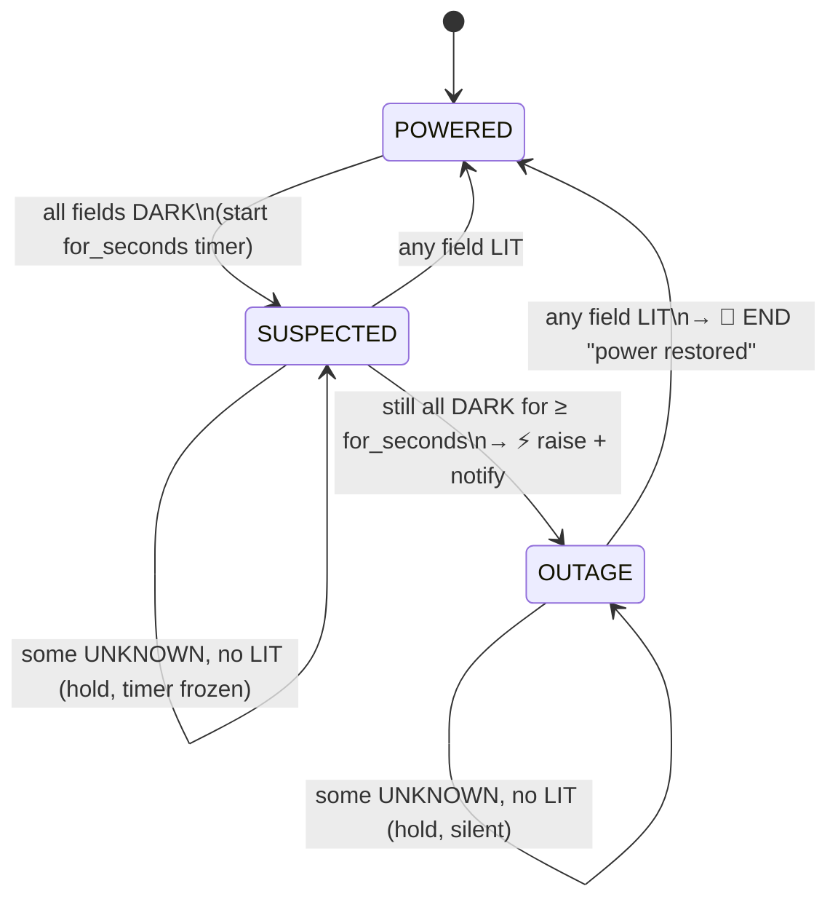

# Blackout detection — state model

Two layers: a **per-field classification** (the input symbols) feeds a
**group-level state machine** (the actual alarm state). Everything is
**event-driven**: the machine only advances when a current reading arrives, so
a dead meter (no readings) freezes it — that is *why* a dying meter can't emit
a false recovery.

## Per-field classification (input)

Each watched field is classified from its **latest reading**, on two axes:
freshness (alive vs dead) and value (below vs at/above `below`).

| Freshness (`age ≤ stale_after`?) | Value vs `below` | State |
|---|---|---|
| alive (fresh) | `< below` | **DARK** (unpowered) |
| alive (fresh) | `≥ below` | **LIT** (power present) |
| dead (stale / missing) | *irrelevant* | **UNKNOWN** |

Note: when a field is **dead** the value axis collapses — a stale reading is
`UNKNOWN` whether it was above or below. So there are **3** field states, not 4.

## Group decision (both fields together)

The group looks at the combination of I1 and I2:

| I1 / I2 | … | Group action |
|---|---|---|
| both **DARK** | | candidate blackout → raise once sustained `for_seconds` |
| **any LIT** | (regardless of the other) | **END** — power proven → back to IDLE |
| otherwise (≥1 **UNKNOWN**, no LIT) | | **HOLD** — no evidence → keep current state, send nothing |

Rule of thumb: **raise on all-DARK, end only on positive proof (any LIT), hold on stale.**

## Group state machine

States use domain names: **POWERED** (no blackout), **SUSPECTED** (all dark,
counting `for_seconds`, still silent), **OUTAGE** (blackout confirmed and
signalled).

Mapping to the code (`AlarmState` in `alarm_manager.py`): **OUTAGE** = `active
== True`; **POWERED** and **SUSPECTED** are both `active == False`, told apart
by `since` (0 = POWERED, non-zero = SUSPECTED, counting from that timestamp).

Every arrow is evaluated **only when a current reading arrives** (from
`on_reading` → `check_blackout_for`). Between readings the state is frozen.

## Parallel machine: device OFFLINE

Field freshness (alive/dead) also drives a **separate, independent** alarm: the
per-**device** offline check (`no message on the topic for 3×interval`). This
runs on the 60 s loop, not on readings. So a meter that dies mid-outage:

- makes its field **UNKNOWN** → the blackout **holds** (no false 🔌 END), and
- trips that device's **OFFLINE** alarm, which is what actually reports the
  silence.

The two machines never send each other's messages; they observe the same
readings for different purposes.

## Did we forget anything?

Variables that shape the behaviour, beyond the three field states:

- **`for_seconds`** — how long all-DARK must persist before raising (IDLE→PENDING→ACTIVE).
- **`stale_after`** — the alive/dead boundary (seconds).
- **`repeat_seconds`** — re-notify cadence while ACTIVE.
- **event-driven timing** — no reading ⇒ no transition (dead meter freezes the machine).
- **the parallel OFFLINE machine** — the real reporter of a silent meter.

See also: [ADR-0007](adr/0007-blackout-detection-from-current.md) and the
Blackout section of the [README](../README.md).
